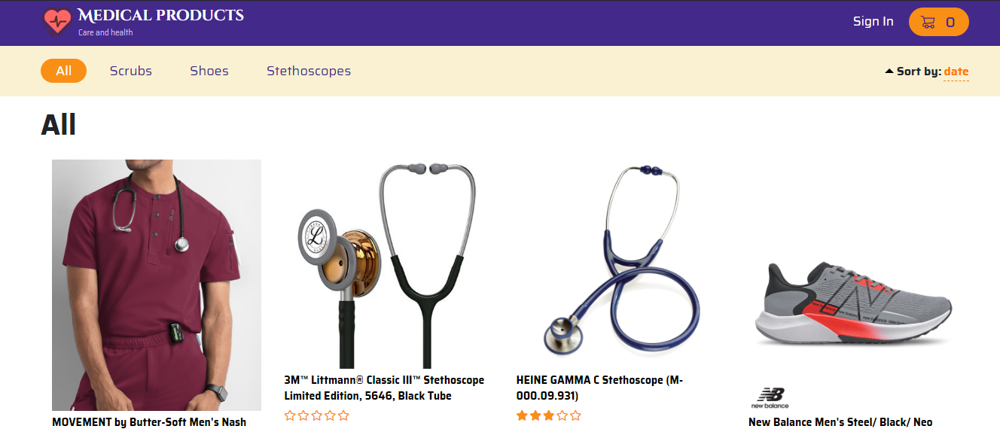

# Medical products #
**E-commerce MERN-application**

> **NOTE:** *To enable admin mode sign in with the following details:*
>   - **email**: bayeshko_gleb@mail.ru;
>   - **password**: frontendisfuture;

## Technology stack ##
* **HTML**;
* **CSS/SASS** *(SCSS)*;
* **MERN stack**:
  * React/Redux,
  * NodeJS,
  * ExpressJS,
  * MongoDB/Mongoose;
* **REST API**.

## NPM libraries ##
* **Frontend:**
  * redux-thunk,
  * react-router-dom,
  * axios,
  * node-sass,
  * js-cookie;
* **Backend:**
  * babel,
  * nodemon,
  * body-parser,
  * jsonwebtoken,
  * multer,
  * sharp,
  * bcrypt;
* **For Heroku deploy:**
  * aws-sdk.

## Functionality ##
- **PRODUCTS**:
  - Main page:
    - sort by category, date, rating;
    - each product has an add-to-cart button (if some product has already been added to the cart, the "add" button changes to the "added" button - when it is clicked, user is redirected to the cart page);
    - each product has five-star rating, based on the reviews left; 
    - if product is presented in several colors, it will have a color selection panel (if user clicks on the add-button without choosing a color, a popup with "Choose color" text will appear);
  - Product details page:
    
    - rating and color panels, add-to-cart button (same rules as on the main page);
    - qty panel;
    - product description;
    - reviews:
      - if there are no reviews, the corresponding inscription will be displayed,
      - if user is not logged in, the sign-in-button will be displayed,
      - if user is logged in, the reviews form with rating selection and text input fields will be displayed,
      - if user has already left a review and tries to leave new review for the same product, a corresponding error will be displayed,
      - each review has a user avatar, five-star rating, date, time, name, second name (if it exists) and review text;
- **CART**:
  
  - All qty changes in cart (adding, deletion, increasing or decreasing products qty) are displayed on the right-top cart button;
  - If cart is empty, a corresponding text and go-main-page button will be displayed on the cart page;
  - On the cart page user can change each product qty, delete product, go to the corresponding product details page by clicking on the product name;
  - Total products qty and final order price are displayed at the bottom of products list;
  - User account compatibility:
    - each registered person has own personal user cart, which saves all products added by user;
    - if user is not logged in, added products to cart and only then logged in (or registered and logged in), these products will be added to personal user cart (identical products in personal user cart will be replaced with the same new ones, i.e. the qty of such products will be updated);
- **USER ACCOUNT**:
  
  - Sign in page:
    - register and sign in ability;
  - Profile page:
    - ability to change name, second name, country, city, sex, password (user must enter current password and new password), avatar (on the server side avatar image will be reduced to 200x200 with cover fitting);
    - go-to-own-cart button;
    - log-out button;
  - Product details page:
    - ability to leave one review for each product (see Products section);
  - Cart:
    - personal user cart (see Cart section);
- **ADMIN MODE**:
  
  - Profile:
    - the admin-panel button is displayed - when it's clicked, user is redirected to the admin panel page;
  - Admin panel page:
    - the page displays the product list and create-new-product button;
    - each product is represented as a row with id, name, price, category, brand and action columns;
    - there are two types of actions for each product - delete and edit;
    - if create-new-product or edit button is clicked, a modal window appears (in case of edit button all fields of the modal window will be filled with current product information, in case of create-new-product button all fields will be empty);
    - the modal window has name, category, image, color, price, brand and description fields and create/update button at the bottom;
- **GENERAL**:
  - Full responsive;
  - Error handling;
  - Dynamic page titles;

*App is boosted with create-react-app*
